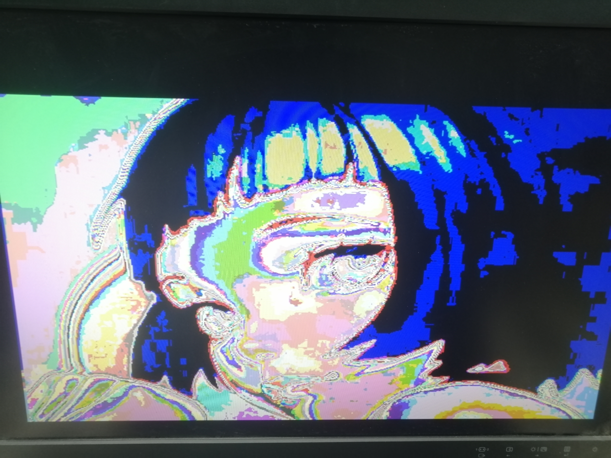

## VGA Controller

> That's one small step for man, one giant leap for mankind.

This is a simple VGA controller.

You can download the bit file to FPGA Artix-7 (xc7a200tfbg676-2) with a VGA screen.

## Bugs

I originally planned to display a picture with a 24 bit color depth, but on the Artix-7 development board, the VGA interface has only a 12 bit color depth, so I only took the high 4 bits of the each RGB channel, which caused the color of the displayed image to be distorted. If you find the solution, pls tell me ~

## Reference

[1] [VGA Signal Timing](http://tinyvga.com/vga-timing)

[2] [Driving a VGA Monitor Using an FPGA – Embedded Thoughts](https://embeddedthoughts.com/2016/07/29/driving-a-vga-monitor-using-an-fpga/)

